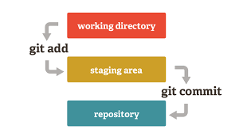
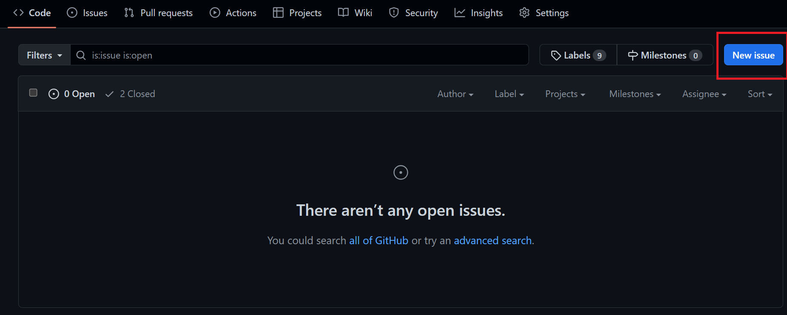

# Class Assignment 1

## Introduction

The fundamental objective of this task was to explore the functionalities of Git and GitHub, two essential components 
in the realm of version control and collaborative software development. Git is a distributed version control system that 
enables tracking changes in source code over time, while GitHub provides a web-based platform for hosting, sharing, and collaborating 
on projects using Git.
The final result of the assignment can be found [here](https://github.com/Departamento-de-Engenharia-Informatica/devops-23-24-JPE-PMS-1231819).

One of the most important skills utilized in this task was working with branches. In the context of version control systems like Git, 
a branch is essentially a parallel line of development that allows you to work on different features, fixes, or experiments 
independently of the main codebase.

When you create a branch, you're essentially creating a snapshot of your project at a specific point in time. This 
snapshot, represented by the branch, allows you to make changes and modifications without affecting the main or other branches. 
It's a powerful mechanism for isolating changes, developing new features, and fixing issues without disrupting the stability of the primary project.

## Getting Started

To start with this tutorial, you should already have a private repository created in the [Department of Informatics Engineering GitHub Organization](https://github.com/Departamento-de-Engenharia-Informatica). 
If you haven't created a repository yet, follow the instructions below:

1. Go to the [Department of Informatics Engineering GitHub Organization](https://github.com/Departamento-de-Engenharia-Informatica) and create a new repository.

### Navigate to your desired repository location

Navigate (in your machine) to the directory where you want your project/repository to be stored using the `cd` command. For example:

```bash
 $ cd /path/to/your/desired/repo/location
````

### Let´s "sinch"...

#### Create new repository on the command line

```bash
$ echo "# My new repository " >> README.md
$ git init
$ git add README.md
$ git commit -m "first commit"
$ git branch -M main
$ git remote add origin git@github.com:Departamento-de-Engenharia-Informatica/chosenRepoName.git (choosen SSH or HTTPS URL)
$ git push -u origin main
````

These instructions outline the process of creating a new Git repository, making an initial commit, setting up the main branch, 
connecting it to a remote repository on GitHub, and pushing the changes.

To clone the code that is going to be used in this assignment you have to:

```bash
$ git clone <the_intended_repository_source_repo_url> 

````

in a desired local machine directory.


## Part 1: Everything on Main Branch

Copy the code of the Tutorial React.js and Spring Data REST Application into a
new folder named CA1

```bash

$ cd /path/to/your/repo/location
$ mkdir CA1
$ cp -r /path/to/source/directory/ /path/to/destination/CA1
$ cd CA1
$ ls -all (to list all files...even the hidden ones)
$ rm -r .git (deleting cloned repository versioning files)

````
If you are copying files from one Git repository to another while preserving the version history, using the cp command
won't maintain the Git history from the copied files. The cp command is a basic file copying tool and doesn't interact with Git repositories.

#### now that you are all set up...

while on repository location it´s time to commit the most recent changes in your working directory. The first step is doing a: 

```bash
$ git status
````
to show the current status of your working directory concerning the changes made to the repository. Then,

```bash
$ git add . 
````
to stage all changes in your working directory for the next commit. This means that it adds all modified files and new untracked 
files to the staging area, preparing them to be included in the upcoming commit.

```bash
$ git commit -m "Descriptive and concise message"
````
This command is used to create a new commit to the local repository in your Git repository with a commit message provided inline

The image below summarises the above steps. 



```bash
$ git push
````
Remember that in the first commit we already synced the upstream 
of main branch with origin. So pushing commits in main branch can now be simplified.

#### Version Tagging

A tag is a reference or label assigned to a specific commit in the version history of a repository. Unlike branches, 
which are dynamic and can be moved to new commits, tags are fixed references that point to a specific commit.

1. Tag the initial version of the application as `v1.1.0` and push the tag to the remote repository:

To create a tag, we can use the following command:
```bash
$ git tag v1.1.0
````

This will create a lightweight tag pointing to the latest commit on the current branch.
To create an annotated tag with additional information like a message and the tagger's name, we can use:

```bash
$ git tag -a v1.1.0 -m "Initial version"
````

Tags are not automatically pushed to remote repositories when you push changes. To push tags, we can use:
```bash
$ git push origin v1.1.0
````

#### Adding new features - Job Years field and support. Also, unitary testing

1. Creation of Issues

There are several ways to create an issue. An "issue" typically refers to a task, bug, enhancement, 
or any other piece of work that needs to be addressed within a project. They are typically assigned a number.
   - We may do use gitHub's  UI.

   <div style="text-align:left; padding: 20px;">
    
</div>

   - Or we can create it using  GitHub CLI (Command Line Interface) (assuming we have it installed)

```bash
$ gh issue create --title "Add job years field and support" --body "Description of the issue"
````

2. After implementing the feature and unit testing, we must repeat the procedure to add and commit the changes. To fix/close automatically 
the corresponding issue we can use the following command:
```bash
   $ git add .
   $ git commit -m "Fix #<issue-number> Added jobYears field and unit Testing"
```

3. A new tag should be created, v1.2.0, to mark our new stable version of application. And our most recent commit must be pushed.
We can use this command to both operations at the same time:

```bash
$ git push && git tag -a v1.2.0 -m "Release version 1.2.0" && git push origin v1.2.0
````
4. At the end of the assignment mark our repository with the tag ca1-part1.

```bash
$ git tag ca1-part1
$ git push origin v1.1.0
````

## Part 2: Using Branches adding new features and bug fixing

The point of part 2 is to illustrate a simple git workflow by creating new branches, merge them and commit the new features. 

1. Develop new features in branches named after the feature. Create a branch named ”email-field” to add a new email field to the application. 
Unit tests for testing the creation of Employees and the validation of their attributes should also be created.

- First we can create issues in advance. The idea is to set specific tasks that should guide the development goals. Ways of creating issues were previously discusses in this tutorial

#### Branch creation - How to? 

- Creating a branch can be done using 
```bash
$ git branch email-field
````
if we want to create a branch and stay at the current branch. 

```bash
$ git checkout -b email-field
````

if we want to create a branch and immediately switch to it. 

### Switching branches 

```bash
$ git checkout email-field
````

##### or we can

```bash
$ git switch email-field
````
##### Just out of curiosity ... 
this command was designed specifically for switching branches. 
It's a high-level command that is more explicit about its intended use.

- After implementing the feature and developing tests, we must add ou work to staging area and commit it 
to the local repository (don´t forget to include automatic issue fixing). 
```bash
   $ git add .
   $ git commit -m "Fixed #<issue-number> Added email field to Employee entity with support and tests"
```
  
Now we have two branches locally (main and email-field), but in the remote server we have only one branch (main). Depending on the scenario,
but normally it´s important to also push the created branch and it´s work to origin. Here are a few reasons why...

- Collaboration - if you are working with a team, pushing "email-field" to the remote repository allows your team members to 
access and collaborate on the changes you've made;
- Backup and Remote Access - pushing branches to the remote repository serves as a backup and allows 
you to access your work from different machines. This is particularly useful when you switch between multiple computers;
- Code Review - if you are using a pull request or merge request workflow, pushing "email-field" to the remote repository allows others to review your code changes before merging into the main branch.
- Integration Testing - pushing "email-field" to the remote repository enables continuous integration (CI) systems to run tests on your branch, ensuring that it 
integrates well with the main branch and other ongoing developments; 
- Feature Branches - if "email-field" represents a feature or a specific piece of work, pushing it to the 
remote repository helps maintain a centralized repository of features in development;

```bash
$ git push -u origin email-field
```
The above command allows us , besides pushing the entire branch along with its content to the remote repository, to set up a tracking relationship between the local branch and the remote branch. When we use the
-u or --set-upstream option with git push, we are setting the upstream branch. The upstream branch is the remote branch that your local branch is tracking.

2. Merge the feature branch into main and tag the new version:

   ```bash
   $ git switch main
   $ git merge --no-ff --no-squash email-field
   $ git tag v1.3.0 -m "email field included and unit testing"
   $ git push origin main
   $ git push origin v1.3.0
   ```
- Switch to main branch;
- Merges the main branch with email-field branch. Creates a new merge commit, preventing a fast-forward merge.
  Preserves the commit history of the "email-field" branch by retaining all individual commits from that branch.
  The commit graph will show a merge commit with a history that includes all the commits from the "email-field" branch.
- Creates a tag with description;
- Pushes main changes made in the local branch main to the corresponding branch in the remote repository.
- Pushes newly created tag. 

#### Bug Fix - fix invalid email

1. Create the issues according to the intended additions. 
2. Constraints regarding email validation should be created, for example, an email should have at least a "@". This new feature should have support and unitary testing.
3. Create and switch to the `fix-invalid-email` branch:
```bash
   $ git checkout -b fix-invalid-email
```

2. After implementing, let's add, commit, and push the bug fix:
```bash
   $ git add .
   $ git commit -m "Fix #<issue-number> Added validation for email field"
   $ git push origin fix-invalid-email
```

3. Merge the fix-invalid-email branch with main branch, tag that stable version of our application and push main branch and newly created tag:

```bash
   $ git switch main
   $ git merge --no-ff --no-squash fix-invalid-email
   $ git tag v1.3.1 -m "fixed email field, checked for '@' character presence"
   $ git push origin main
   $ git push origin v1.3.1
```

4. Create final tag to mark the completion of CA-part 2:
```bash
   $ git tag ca1-part2 -m "End of CA1 Part 2"
   $ git push origin ca1-part2
```


## Alternative approach to versioning 

### SVN as the chosen one ...

Subversion (SVN) is a centralized version control system primarily used for managing files and directories. Here are its main characteristics:

1. Centralized Repository: SVN follows a centralized version control model, meaning there's a single central repository that stores all versions of files. Developers checkout files from this central repository, make changes, and then commit those changes back to the repository.

2. Client-Server Architecture: SVN operates on a client-server architecture where users interact with a central server to manage their files. The server hosts the repository, and clients interact with it to perform version control operations.

3. Access Control and Authorization: SVN allows administrators to set up access control and authorization mechanisms, ensuring that only authorized users can perform certain operations on the repository.

4. Support for Binary Files: SVN can handle binary files as well as text files, making it suitable for managing a wide range of file types, including images, executables, and documents.

Overall, SVN is a robust version control system that provides essential features for managing software development projects effectively. However, in recent years, distributed version control systems like Git have gained popularity due to their decentralized nature and powerful branching and merging capabilities.

### Comparison to Git

1. Architecture:

- SVN: Uses a centralized architecture, where there's a single central repository that stores all versions of files. Users check out and check in directly to this central repository.
- Git: Uses a distributed architecture, where each user has a complete copy of the repository, including the entire commit history. Users can work offline and collaborate without relying on a constant network connection.
Change Tracking:

- SVN: Uses revision numbers to identify individual commits.
- Git: Uses SHA-1 hashes to identify commits. This generates unique commit identifiers for each change, which can aid data integrity and security.
- 
2. Branching and Merging:

- SVN: Supports branching and merging, but they are heavier and can be more cumbersome compared to Git. Branches in SVN are separate directories in the repository.
- Git: Has an extremely flexible and lightweight branching and merging system. Branching and merging are fast and efficient operations, enabling complex branching workflows.

3. Performance:

- SVN: Tends to be slower in operations involving the entire repository history, such as cloning or updating.
- Git: Generally faster, especially in local operations, due to its distributed nature and efficient object storage.

4. Management of Binary Files:

- SVN: Treats binary and text files similarly.
- Git: Is more efficient in managing binary files due to its optimized object model.

5. Scale and Project Size:

- SVN: Can face performance and scalability issues in very large projects due to its centralized nature.
- Git: Scales well even in large projects, thanks to its distributed architecture and support for local operations.

### Implementing with SVN

#### Initial Setup

1. **Create SVN Repository**: An SVN repository can be created on a server that all team members have access to.
```bash
   $ svnadmin create /path/of/the/repository
```

2. **Check Out the Repository**: 
```bash
   $ svn checkout http://svnRepo/repository
```

#### Adding the Tutorial Application

##### Just out of curiosity ... 
In Subversion (SVN), the term "trunk" typically refers to the main line of development in a repository. It's the directory where the primary development of a project occurs.

When you create a new SVN repository, it usually starts with a directory structure that includes a "trunk" directory by default. This "trunk" directory serves as the main branch of your project, where the ongoing development takes place.

1. **Adding the Project to the Repository**: 
```bash
   $ cd projectLocation
   $ svn add *
```

2. **Initial Commit**: Commit the added files to the repository.
```bash
   $ svn commit -m "Initial commit"
```

#### Tagging in SVN

1. **Create a Tag**: SVN does a copy for branching and tagging. To tag a specific commit, you create a copy of it in the directory of the tag's creation
```bash
 $ svn copy ^/trunk ^/tags/release-1.0 -m "Creating a tag for version 1.0"
```

#### Implementing New Features and Bug Fixes

1. **Branching**: Similar to tagging, create a branch by copying the trunk or another branch.
```bash
  $ svn copy ^/trunk ^/branches/email-field -m "Branch for email field feature"
```

2. **Merging Branches**: The new feature branch can be merged back into the trunk branch.
```bash
  $ cd path/to/trunk
  $ svn merge --reintegrate http://basePath/repository/branches/email-field
  $ svn commit -m "Merged the email-field with trunk."
```
