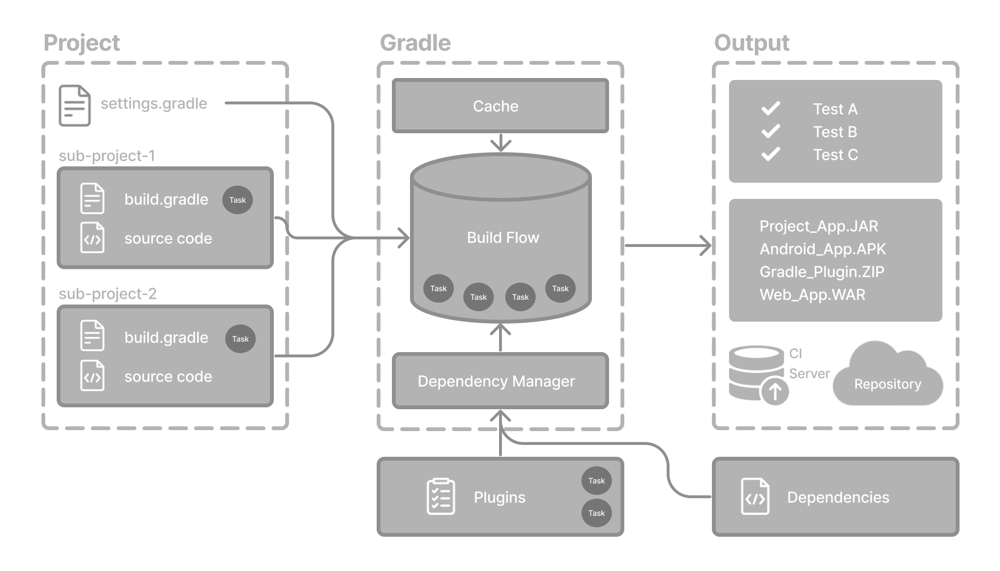

## Class Assignment 2

<style>
    body {
        color: rgba(0,255,247,0.55);
    }
</style>

## Introduction

The fundamental objective of part 1 of CA2 is to explore basic features of the chosen build 'Gradle' tool.
The developed work can be found here [personal project](https://github.com/Departamento-de-Engenharia-Informatica/devops-23-24-JPE-PMS-1231819)

- First of all, the main question... 
#### What is gradle? 

Gradle is a build automation tool, by that we mean...

```
The process of automating the creation of a software build and related processes: 
 -> Compiling source code to binary code;
 -> Packaging binary code;
 -> Running automated tests;
 -> Managing dependencys;
 -> Deploying projects;
````

#### Gradle Core concepts

1. Projects
2. Build scripts
3. Dependency Management
4. Tasks
5. Plugins

#### Gradle automates building, testing, and deployment of software from information in build scripts.
<style>
.image-container {
    max-width: 80%; 
    margin: 0 auto; 
    padding: 20px;
}

.responsive-image {
    max-width: 100%;
    max-height: 400px; 
    width: auto;
    height: auto;
    display: block;
    margin: 0 auto; 
}
</style>

<div class="image-container" style="text-align:left; padding: 20px;">
    
</div>

#### 1.Projects 

````
A project in gradle is software that can be built. It can be wetther an app or a library.
Single project builds have a single project (root). Multi project builds have one root project and subprojects.
````
#### 2.Build scripts

````
A build script is, as we can infer, the "script" that tells gradle what steps should it take to build the project.
A project must have at least one build script.
````

#### 3.Dependency Management

````
Technique that automates the resolving and declaring external resources required by a project.
Every project has external dependencies, but gradle resolves those during build.
````
#### 4.Tasks

````
The most basic unit of work susch as: compiling code, running tests...
Each project has many tasks definide in buil.gradle (build script) and in plugins.

Note -> Check ./gradlew tasks in CLI to see all the available tasks in your project
````

#### 5.Plugins

````
Extends gradle's capabilities and adds tasks to a project.
````

### Project structure 

Understanding the inner workings of a build tool without understanding it´s project structure is an impossible mission so
let´s explore it...

- Fun fact: Many developers will interact with Gradle for the first time through an existing project.

#### How to know if my project is being managed by gradle ? 

The gradlew and gradlew.bat files in the root directory of a project shows that Gradle is being used.

Here is gradle´s basic project structure:

<style>
.image-container {
    max-width: 80%; 
    margin: 0 auto; 
    padding: 20px;
}

.responsive-image {
    max-width: 100%;
    max-height: 400px; 
    width: auto;
    height: auto;
    display: block;
    margin: 0 auto; 
}
</style>

<div class="image-container" style="text-align:left; padding: 20px;">
    
</div>

- This image shows a multi project build where it can be seen the most important files to understand gradle´s project structure:
1. Gradle directory to store wrapper files;
2. gradlew and gradlew.bat - Gradle wrapper scripts;
3. settings.gradle(.kts) - Gradle settings file to define a root project name and subprojects
4. Project A/B that has inside the source code and gradle build scripts (gradle.build)

#### Now that we have all the basic information to start this class assignment...

#### 1. First let´s start by pulling the sample project [Sample_Gradle_Project](https://bitbucket.org/pssmatos/gradle_basic_demo/src/master/) and store it the required folder **CA2/Part1/gradle_basic_demo/.** - More information about how to pull a project using git on **CA1/README.md**
#### 2. Define issues - more information about how to define issues using GitHub on CLI or in it´s website on **CA1/README.md**
#### 3. Read the instructions available in the readme.md file and experiment with the application;
#### 4. Add a new task to execute the server...

### What is a task? 

- A tasks represents some independent unit of work that a build performs, compiling classes, creating a JAR, generating JavaDocs or publishing archives 
to a directory.
- It is possible to run a build task by typing in CLI:
````
./gradlew build
````
- In this scenario it was asked to create a task to execute the server side of our app, so: 
````
task runServer(type:JavaExec, dependsOn: classes){
    group = "DevOps"
    description = "Launches chat server on 59001 port"
    classpath = sourceSets.main.runtimeClasspath

    mainClass = 'basic_demo.ChatServerApp'

    args '59001'
}
````
Let´s explain each step: 

Note: Gradle build scripts are primarily written in Groovy, a dynamic programming language for the Java Virtual Machine (JVM). 
"Gradle is groovy, Groovy is Java"...

- Task Declaration - task runServer: This line declares a new task named runServer.
- Task Type - type - JavaExec: This specifies that the task is of type JavaExec, which means it will execute a Java application.
- Dependencies - dependsOn: classes: This line specifies that the runServer task depends on the classes task. It means that before executing the runServer task, 
Gradle will ensure that the classes task (which typically compiles the Java classes) has been executed successfully.
- Task Group - group = "DevOps": This assigns the task to a specific group named "DevOps". Grouping tasks is a way to organize and categorize them for better management and visibility.
- Task Description - description = "Launches chat server on 59001 port": This provides a description for the task, explaining what it does. Descriptive task descriptions help users 
understand the purpose of the task.
- Classpath Configuration - classpath = sourceSets.main.runtimeClasspath: This line sets the classpath for the task. It configures the classpath to include the runtime classpath of 
the main source set. This ensures that the necessary classes and dependencies required to run the Java application are available.
- Main Class Specification - mainClass = 'basic_demo.ChatServerApp': This specifies the main class of the Java application that will be executed by the JavaExec task. In this case, it is basic_demo.ChatServerApp.
- Arguments - args '59001': This line provides arguments to the Java application being executed. Here, it specifies that the chat server should be launched on port 59001.

In summary, the runServer task is configured to execute a Java application (ChatServerApp) with specific arguments (59001). 
It depends on the classes task to ensure that the necessary classes are compiled before execution. Additionally, it is grouped under "DevOps" 
and provided with a descriptive explanation of its purpose.

#### 5. Add a simple unit test and update the gradle script so that it is able to execute the test.
- The following unit test was created:

````
  @Test
    public void testAppHasAGreeting() {
        App classUnderTest = new App();
        assertNotNull("app should have a greeting", classUnderTest.getGreeting());
    }
````
- To allow this unit test to run we need to add a dependency to our build.gradle file: 

````
   dependencies {
     // Use Apache Log4J for logging
     implementation group: 'org.apache.logging.log4j', name: 'log4j-api', version: '2.11.2'
     implementation group: 'org.apache.logging.log4j', name: 'log4j-core', version: '2.11.2'
+    testImplementation group: 'junit', name: 'junit', version: '4.12'
 }
````
- Let's dive a bit further into that: 

Regarding the Gradle configuration:

The dependencies block in the build.gradle file specifies project dependencies. Dependencies are external libraries or modules required by the project.
The testImplementation configuration is used to declare dependencies that are required only for testing purposes. This includes the JUnit framework, 
which is a popular testing framework for Java applications.
By adding JUnit as a test dependency, the project can compile and execute JUnit tests.

#### 6. Add a new task of type Copy to be used to make a backup of the sources of the application.
- It should copy the contents of the src folder to a new backup folder.

````
task backupSources(type: Copy) {
    from 'src' // Source directory
    into 'backup/src_backup' // Destination directory for backup

}

task deleteBackup(type: Delete) {
    delete 'backup' // automating backup deleting
}
````

##### Let´s explain the following tasks:

**backupSources Task:**

This task is of type Copy, which means it copies files from one location to another.
from 'src': Specifies the source directory from which files will be copied. In this case, it's the src directory.
into 'backup/src_backup': Specifies the destination directory where files will be copied. In this case, it's the backup/src_backup directory.

**deleteBackup Task:**

This task is of type Delete, which means it deletes files or directories.
delete 'backup': Specifies the directory or file to be deleted. In this case, it's the backup directory.

#### 7. Add a new task of type Zip to be used to make an archive of the sources of the application.
- It should copy the contents of the src folder to a new zip file.

````
task createZip(type: Zip) {
from 'src'
archiveFileName = 'myZippedFile.zip'
destinationDirectory = file("$buildDir")
}


task deleteZip(type: Delete) {
delete file("$buildDir/myZippedFile.zip")
}
````

##### Let´s explain the following tasks:

- **createZip Task** - Type: Zip - Purpose: This task is responsible for creating a ZIP archive containing files from the src directory.

- **Actions: from 'src'** - Specifies the source directory from which files will be included in the ZIP archive. In this case, it's the src directory.

- **archiveFileName** = 'myZippedFile.zip' - Specifies the name of the ZIP archive to be created. In this case, it's myZippedFile.zip.

- **destinationDirectory** = file("$buildDir") - Specifies the destination directory where the ZIP archive will be generated. It's configured to use the build directory ($buildDir),
which is typically a directory named build in the project directory.

- **deleteZip Task** - Type: Delete
- **Purpose:** This task is responsible for deleting the previously created ZIP archive.
- **Actions:** delete file("$buildDir/myZippedFile.zip") - Specifies the file path of the ZIP archive to be deleted. It's configured to delete the ZIP file located in the build directory with the name myZippedFile.zip.

In summary, the createZip task creates a ZIP archive containing files from the src directory and saves it to the build directory with the
name myZippedFile.zip. The deleteZip task deletes the previously created ZIP archive from the build directory. These tasks can be executed as part of the build process 
using Gradle commands, providing functionality for archiving and managing files within the project.


 


