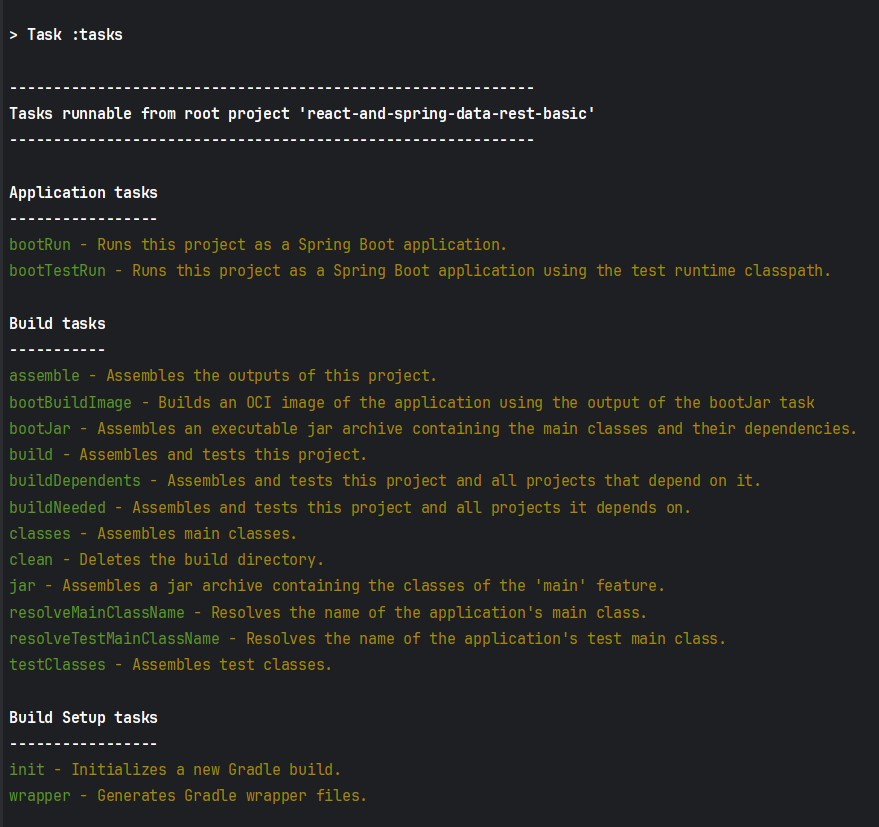

## Class Assignment 2 - Part 2

<style>
    body {
        color: rgb(153,158,255);
    }
</style>

## Introduction

The fundamental objective of part 2 of CA2 is to explore basic features of the chosen build 'Gradle' tool.
The developed work can be found here [personal project](https://github.com/Departamento-de-Engenharia-Informatica/devops-23-24-JPE-PMS-1231819)
This part has a set of steps that mobilize competences of managing plugins, dependencies and adding tasks. 

#### "In your repository create a new branch called tut-basic-gradle. You should use this branch for this part of the assignment (do not forget to checkout this branch)"
1. Information about this step can be found in CA1'S README file.

#### "As instructed in the readme file of the tutorial, use https://start.spring.io to start a new gradle spring boot project with the following dependencies: Rest Repositories; Thymeleaf; JPA; H2."
1. Spring Initializer is a web-based tool provided by the Spring team to help developers quickly bootstrap Spring-based projects. It allows you to generate a skeleton project structure with the necessary dependencies and configuration for your specific needs.
2. The "Rest Repositories" dependency in Spring refers to the Spring Data REST module. Spring Data REST builds on top of Spring Data and Spring MVC to provide a convenient way to expose JPA repositories as RESTful endpoints. 
When you include the "Rest Repositories" dependency in your project, it allows you to expose your JPA repositories as RESTful endpoints automatically, without having to write explicit controller code. Spring Data REST handles the HTTP requests and responses for basic CRUD operations (Create, Read, Update, Delete) on your entities.
3. Thymeleaf is a modern server-side Java template engine for web and standalone environments. It enables natural and fluid templating for HTML documents. Thymeleaf templates can be used as is in static (HTML only) or dynamic (server-side processed) web applications. 
4. JPA stands for Java Persistence API. It is a Java specification for managing relational data in applications using Java EE and Java SE environments. JPA provides a standard way for Java developers to interact with relational databases using object-oriented approaches.
5. Spring Data JPA is a part of the larger Spring Data project that aims to simplify data access in Spring-based applications. Specifically, Spring Data JPA provides an additional layer of abstraction on top of JPA (Java Persistence API) to further reduce the amount of boilerplate code required for typical data access tasks.
6. H2 is a fast, open-source, in-memory database written in Java. It's commonly used for development and testing purposes because of its lightweight nature and ease of setup. It allows developers to quickly prototype applications without needing to configure a separate database server.

#### "Extract the generated zip file inside the folder ”CA2/Part2/” of your repository. We now have an ”empty” spring application that can be built using gradle. You can check the available gradle tasks by executing ./gradlew tasks."

###### What does gradle tasks do? 

- The command ./gradlew tasks is used to display a list of available tasks that can be executed by Gradle for the specified project. When you run ./gradlew tasks, Gradle will analyze the project's build scripts (typically build.gradle files) and list all the tasks that are defined within them.

- Here his the current output of this task in of our project: 

<style>
.image-container {
    max-width: 80%; 
    margin: 0 auto; 
    padding: 20px;
}

.responsive-image {
    max-width: 100%;
    max-height: 400px; 
    width: auto;
    height: auto;
    display: block;
    margin: 0 auto; 
}
</style>

<div class="image-container" style="text-align:left; padding: 20px;">
    
</div>


#### "Add the gradle plugin org.siouan.frontend to the project so that gradle is also able to manage the frontend."

- In my case I have java 17, so I added to build.gradle id "org.siouan.frontend-jdk17" version "8.0.0"
- The plugin org.siouan.frontend helps manage frontend assets, such as JavaScript, CSS, and HTML, within a Java project.
- Add also "packageManager": "npm@9.6.7", - package manager config to package.json file.
- npm (Node Package Manager) is a widely used package manager for JavaScript development, and it's commonly used to manage dependencies for frontend projects built with tools like React, Angular, or Vue.js. 
By including this configuration in your package.json file, you ensure that npm will be used to install and manage the frontend dependencies for your project.


#### "Add also the following code in build.gradle to configure the previous plug-in"

- Overall, this configuration block provides a way to define Node.js version requirements and specify custom scripts for building, cleaning, and checking the frontend code within a Gradle project.
- Where are these scripts specified ? Let's see in next step.
````
frontend {

 nodeVersion = "16.20.2"
 assembleScript = "run build"
 cleanScript = "run clean"
 checkScript = "run check"
 }
````

#### "Update the scripts section/object in package.json to configure the execution of webpack"
- In previous step we saw that fronted block specifies scripts to be executed during certain lifecycle phases of your build process.
- For example: By setting assembleScript to "run build", you're indicating that when Gradle executes the assembly task, it should run the build script.
- That build script is in package.json with the following instructions (in this case): npm run webpack.
````
"scripts": {
 "webpack": "webpack",
 "build": "npm run webpack",
 "check": "echo Checking frontend",
 "clean": "echo Cleaning frontend",
 "lint": "echo Linting frontend",
 "test": "echo Testing frontend"
 }
````

#### "Add a task to gradle to copy the generated jar to a folder named ”dist” located at the project root folder level"
- This task copies the JAR file generated by the bootJar task from the build/libs directory into the dist directory. It ensures the JAR file is available for distribution or deployment.
- I opted to make it depend on bootJar so I don't have the chance to run this task without having an actual jar already created. 

````
task copyJar(type: Copy,dependsOn: bootJar) {
	from "build/libs"
	description "Copies jar into dist folder"
	into "dist"
	include "*.jar"
}
````

### "Add a task to gradle to delete all the files generated by webpack (usually located at src/resources/main/static/built/). This new task should be executed automatically by gradle before the task clean."

- The deleteWebPack task deletes webpack-generated content from the src/main/resources/static/built directory. It is executed as part of the clean task to ensure the project directory is clean before building.

````
task deleteWebPack(type: Delete) {
	description "deletes built/. webpack generated content"
	delete 'src/main/resources/static/built'
}
clean.dependsOn(deleteWebPack)
````

## Alternative implementation solution
An alternative solution to using Gradle as the build tool for the assignment is to utilize Maven. Maven is another popular build automation tool primarily used for Java projects. Unlike Gradle, Maven utilizes an XML file called pom.xml to define the project's structure and dependencies.
Here are the instructions to implement the assignment using Maven:

1. #### "As instructed in the readme file of the tutorial, use https://start.spring.io to start a new maven spring boot project with the following dependencies: Rest Repositories; Thymeleaf; JPA; H2."


2.  Add the frontend-maven-plugin to the project by including the following code in the pom.xml file:
```xml
<plugin>
    <groupId>com.github.eirslett</groupId>
    <artifactId>frontend-maven-plugin</artifactId>
    <version>1.9.1</version>
    <configuration>
        <installDirectory>target</installDirectory>
    </configuration>
    <executions>
        <execution>
            <id>install node and npm</id>
            <goals>
                <goal>install-node-and-npm</goal>
            </goals>
            <configuration>
                <nodeVersion>v12.14.0</nodeVersion>
                <npmVersion>6.13.4</npmVersion>
            </configuration>
        </execution>
        <execution>
            <id>npm install</id>
            <goals>
                <goal>npm</goal>
            </goals>
            <configuration>
                <arguments>install</arguments>
            </configuration>
        </execution>
        <execution>
            <id>webpack build</id>
            <goals>
                <goal>webpack</goal>
            </goals>
        </execution>
    </executions>
</plugin>
```
3. Add copyJar Task: Include the copyJar task in the project's pom.xml file:
```xml
	<plugin>
    <groupId>org.apache.maven.plugins</groupId>
    <artifactId>maven-resources-plugin</artifactId>
    <version>3.2.0</version>
    <executions>
        <execution>
            <id>copy-jar</id>
            <phase>package</phase>
            <goals>
                <goal>copy-resources</goal>
            </goals>
            <configuration>
                <outputDirectory>${project.basedir}/dist</outputDirectory>
                <resources>
                    <resource>
                        <directory>${project.build.directory}</directory>
                        <includes>
                            <include>*.jar</include>
                        </includes>
                    </resource>
                </resources>
            </configuration>
        </execution>
    </executions>
</plugin>
```
4. Add deleteWebpackFiles Task: Integrate the deleteWebpackFiles task into the project's pom.xml file:
```xml
<plugin>
    <artifactId>maven-clean-plugin</artifactId>
    <version>3.1.0</version>
    <configuration>
        <filesets>
            <fileset>
                <directory>${project.basedir}/src/main/resources/static/built</directory>
                <includes>
                    <include>**/*</include>
                </includes>
            </fileset>
        </filesets>
    </configuration>
</plugin>
```
5. Compile the Project: Compile the Maven project using the following command:
```bash
./mvnw clean compile
```
6. Run the app:
```bash
./mvnw spring-boot:run
```

#### Maven:

**Challenges:**

- XML Configuration: Maven's configuration is XML-based, which can make the configuration files larger and more verbose.
- Limited Flexibility: Maven's declarative nature can sometimes limit flexibility in certain complex build scenarios.

**Advantages:**

- Stability: Maven is a mature and stable build tool with a large ecosystem of plugins and documentation.
- Convention Over Configuration: Maven follows conventions over configuration, which can lead to quicker project setup and less decision-making overhead.

#### Gradle:

**Challenges:**

- Learning Curve: Gradle's Groovy-based DSL can have a steeper learning curve for developers not familiar with Groovy.
- Build Script Size: Gradle build scripts can sometimes be smaller than equivalent Maven configurations but may require additional scripting for complex tasks.

**Advantages:**

- Flexibility: Gradle offers more flexibility and customization options than Maven, allowing for more complex build scenarios.
- Performance: Gradle's incremental build feature can lead to faster build times, especially for large projects with many submodules.
- 
In summary, while Maven's convention-over-configuration approach and stability are advantageous, Gradle's flexibility and potential for 
faster build times make it appealing, albeit with a potentially steeper learning curve.


