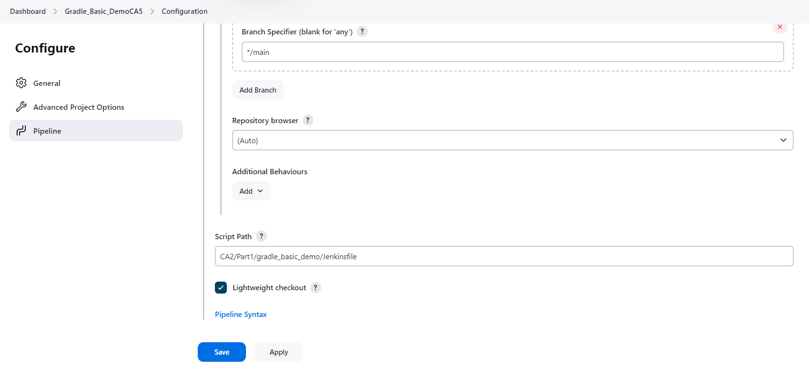
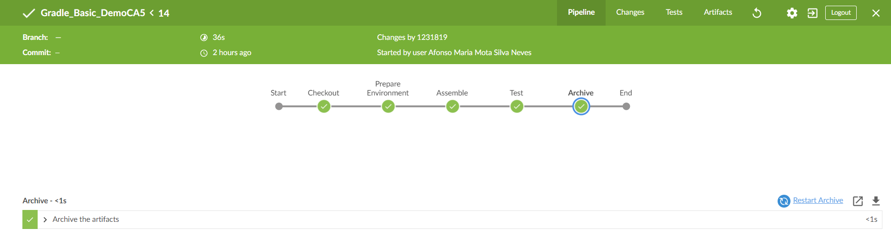

## Class Assignment - 5
The goal of this assignment is to create a pipeline with multiple stages using Jenkins. The projects 
used will be the "gradle basic demo" project and the "react-and-spring-data-rest-basic" project,
which can be found at the provided [link.](https://github.com/Departamento-de-Engenharia-Informatica/devops-23-24-JPE-PMS-1231819)

### What is Jenkins?

Jenkins is an open-source automation server written in Java. It is designed to help automate the parts of software 
development related to building, testing, and deploying, facilitating continuous integration and continuous delivery (CI/CD).


### Some important Jenkins concepts ....

### Node
In Jenkins, a node is a machine that is part of the Jenkins environment. Nodes can be either the master (controller) 
or agents (slaves) that perform the actual work.

**Master Node**: The central server in a Jenkins installation that handles:

- Scheduling build jobs.
- Dispatching builds to agent nodes for actual execution.
- Monitoring the status of builds.
- Recording and presenting the build results.

**Agent Node (Slave)**: 

A machine set up to offload builds from the "master" node. Agents can run on different operating systems and provide 
scalability by distributing workloads.

### Job
A task or a series of tasks configured in Jenkins. A job can be:

- Freestyle Project: A simple job with basic configuration.
- Pipeline: A more complex job defined in a **Jenkinsfile**, representing a CI/CD pipeline with multiple stages.


### Stage

A step in a Jenkins Pipeline that represents a major phase of the software development process.

### Jenkins' installation and set up 

- For this class assignment, I chose to host jenkins in a docker container alongside a docker in docker container 
for docker related commands.

- Follow these steps for Jenkins in Docker set up: 
1. Create a jenkins network (Make sure docker engine is running)

````bash
 $ docker network create jenkins
````
This command will create a network for both containers to connect. This is also the best 
practice when we want to have containers communicating via a bridge network, it's best to create a bridge 
network than to use the "default" docker bridge network.

2. Run a docker:dind 

````bash
 $ docker run --name jenkins-docker --rm --detach ^
  --privileged --network jenkins --network-alias docker ^
  --env DOCKER_TLS_CERTDIR=/certs ^
  --volume jenkins-docker-certs:/certs/client ^
  --volume jenkins-data:/var/jenkins_home ^
  --publish 2376:2376 ^
  docker:dind
````
- "Docker in Docker" (often abbreviated as DinD) refers to the practice of running Docker itself inside a 
Docker container.
- A Docker container is started with the Docker engine running inside it, allowing Docker commands to be executed 
within the container.
- The previous command runs a DinD docker in detached mode with higher privileges. It connects it with the previously 
created network (jenkins), creates a network alias for this docker (docker), defines two volumes and publishes/maps 
2376 port.

3. Customize the official Jenkins Docker image by executing the following two steps:
- Create a Dockerfile with the following content:
````bash
FROM jenkins/jenkins:2.452.1-jdk17

USER root

RUN apt-get update && apt-get install -y lsb-release

RUN curl -fsSLo /usr/share/keyrings/docker-archive-keyring.asc \
  https://download.docker.com/linux/debian/gpg
  
RUN echo "deb [arch=$(dpkg --print-architecture) \
  signed-by=/usr/share/keyrings/docker-archive-keyring.asc] \
  https://download.docker.com/linux/debian \
  $(lsb_release -cs) stable" > /etc/apt/sources.list.d/docker.list
  
RUN apt-get update && apt-get install -y docker-ce-cli

USER jenkins

RUN jenkins-plugin-cli --plugins "blueocean docker-workflow"
````
- This docker image is from the official jenkins image, it sets the GPG keys for docker, installs the docker CLI 
and installs the Jenkins plugins blue ocean and docker-workflow.

4. Build a new docker image from this Dockerfile

````bash
 $ docker build -t myjenkins-blueocean:2.452.1 .
````
5. Run the myjenkins-blueocean:2.452.1 image as a container with a set of configurations 

````bash
 $ docker run --name jenkins-blueocean --restart=on-failure --detach ^
  --network jenkins --env DOCKER_HOST=tcp://docker:2376 ^
  --env DOCKER_CERT_PATH=/certs/client --env DOCKER_TLS_VERIFY=1 ^
  --volume jenkins-data:/var/jenkins_home ^
  --volume jenkins-docker-certs:/certs/client:ro ^
  --publish 8080:8080 --publish 50000:50000 myjenkins-blueocean:2.452.1
  udo docker exec ${CONTAINER_ID or CONTAINER_NAME} cat /var/jenkins_home/secrets/initialAdminPassword
````
- This command runs a jenkins container with blue ocean, connects it with jenkins network, set's the docker host
for docker related commands to the previously created Dind, publishes/maps port 8080 and 5050 ports and set's two volumes.
- These volumes are shared with Dind docker, so it accesses the same information. 

6. Set up Wizard 

- Go to http://localhost:8080/ and check Jenkins main page. 
- When you first access a new Jenkins instance, you are asked to unlock it using an automatically generated password.


- In terminal type to find the initial password!
````bash
  $ docker logs <container-id or name> 
````
7. Customize Jenkins with plugins

- The initial page will suggest installing the recommended plugins.
- After installation, see if any important plugin is missing in the plugins section.

- If any plugin is missing, you can install it via CLI ou Web interface.

## Class assignment tutorial - Gradle Basic Demo

- Regarding the first steps: 


### Pipeline set-up 
1. The **Gradle basic demo** project is already present in this repository in [CA2/Part1](https://github.com/Departamento-de-Engenharia-Informatica/devops-23-24-JPE-PMS-1231819).
2. My repository is private, so git credentials must be set in global credentials. Go to Jenkins configuration (security) 
and credentials.


3. Configure pipe line 
 - Select a new item type and choose Pipeline, let's name it **Gradle_Basic_DemoCA5**
 
 - Configure pipeline for SCM (git), specify repository URL and add previously defined credentials.
   
 - **Select the desired branch (main) and specify the Jenkinsfile relative path**
   

### Jenkinsfile 

- As previously explained, a Jenkinsfile relative path must be specified in pipeline configuration. So we must produce
a Jenkinsfile that matches the requirements and commit it to [project](https://github.com/Departamento-de-Engenharia-Informatica/devops-23-24-JPE-PMS-1231819).
- Let's analyse Gradle basic demo jenkins file (all steps changes the working directory to CA2/Part1/gradle_basic_demo/):
1. **Stage Checkout**

````bash
 pipeline {
    agent any

    stages {
        stage('Checkout') {
            steps {
                echo 'Checking out...'
                script {
                    def gitCredentials = credentials('GH-Cred')
                    if (gitCredentials != null) {
                        git credentialsId: 'GH-Cred', url: 'https://github.com/Departamento-de-Engenharia-Informatica/devops-23-24-JPE-PMS-1231819.git', branch: 'main'
                    } else {
                        error('Failed to retrieve Git credentials')
                    }
                }
            }
        }
    }
}

````
- This jenkinsfile states that this pipeline may run in any available Jenkins agent (we will build on the built-in node);
- Retrieves git-hub credentials and clones the specified git-hub project.

2. **Environment preparation and assemble**
````bash
 pipeline {
    agent any

    stages {

        stage('Prepare Environment') {
            steps {
                echo 'Setting file permissions...'
                dir('CA2/Part1/gradle_basic_demo/') {
                    sh 'chmod +x ./gradlew'
                }
            }
        }

        stage('Assemble') {
            steps {
                dir('CA2/Part1/gradle_basic_demo/') {
                    sh './gradlew assemble'
                }
            }
        }
    }
}
````
- First, it gives execution permissions to Gradle wrapper and invokes a Gradle task "assemble." This task will compile the source
code, process resources (copies resources to the build directory) and package the app in a final distributable artifact (jar).

3. **Test and archives the JUnit test results as build artifacts**

````bash
 pipeline {
    agent any

        stage('Test') {
            steps {
                dir('CA2/Part1/gradle_basic_demo/') {
                    sh './gradlew test'
                    junit 'build/test-results/**/*.xml'
                }
            }
            post {
                always {
                    dir('CA2/Part1/gradle_basic_demo/') {
                        archiveArtifacts 'build/test-results/**/*.xml'
                    }
                }
            }
        }
    }
}

````
- Runs the test task, compiles the test sources, runs the tests, and generates the test reports.
- It looks for XML files matching the pattern build/test-results/**/*.xml and archives them in Jenkins. 
This allows Jenkins to display the test results and trends over time.
- The post-block contains actions that are executed after the steps have run, regardless of the stage's success or failure.
- Archives the test result files matching the pattern build/test-results/**/*.xml. This ensures that the test results 
are saved as build artifacts, which can be reviewed later

4. **JAR files archiving**
````bash
 pipeline {
    agent any

    stages {
      
        stage('Archive') {
            steps {
                dir('CA2/Part1/gradle_basic_demo/') {
                    archiveArtifacts artifacts: 'build/**/*.jar', allowEmptyArchive: true
                }
            }
        }
    }
}

````

- By archiving here we mean collecting the build artifacts (such as JAR files) and storing them in a location where 
they can be easily accessed later by Jenkins. 

**Remember to commit this "Jenkinsfile" to the project**

### Run the pipeline 

- You can run the pipeline in the "standard" Jenkins dashboard 

- Or use blue ocean for a more appealing UI

- Let's use blue ocean and click on your pipeline name (**Gradle_Basic_DemoCA5**) and run

- After clicking on run we should see a visual appealing pipeline stages UI

- Check tests

- Check artifacts


## Class assignment tutorial - React-and-spring-data-rest-basic


### Pipeline set-up

1. The **React-and-spring-data-rest-basic** project is already present in this repository in [CA2/Part2](https://github.com/Departamento-de-Engenharia-Informatica/devops-23-24-JPE-PMS-1231819);
2. All steps regarding pipeline configuration are already explained in the previous steps;
3. Add to Jenkins global credentials your docker hub credentials, follow the same steps you followed for git credentials;
4. Remember to adapt the relative path of the Jenkinsfile path
   

### Jenkinsfile 

- This "Jenkinsfile", although similar, has some key differences from the one previously analyzed.
- Since some stages are very similar, they will not be explained, the full version of the Jenkinsfile may be found
here [CA2/Part2](https://github.com/Departamento-de-Engenharia-Informatica/devops-23-24-JPE-PMS-1231819).
- **This time we will also create a docker image and public that image in docker hub, making use of the dind docker**

1. Set Docker credential, clone repository and give Gradle wrapper execution permissions

````bash
 pipeline {
    agent any

    environment {
        DOCKER_CREDENTIALS_ID = 'DockerHub-Cred'
        DOCKER_IMAGE = "afonsomaria1271819/ca5part2:${env.BUILD_ID}"
    }

    stages {
        stage('Checkout') {
            steps {
                echo 'Checking out the code...'
                git credentialsId: 'GH-Cred', url: 'https://github.com/Departamento-de-Engenharia-Informatica/devops-23-24-JPE-PMS-1231819.git', branch: 'main'
            }
        }

        stage('Prepare Environment') {
            steps {
                echo 'Setting file permissions...'
                dir('CA2/Part2/react-and-spring-data-rest-basic') {
                    sh 'chmod +x ./gradlew'
                }
            }
        }

    }
}

````
- This jenkins file states that this job may be run in any agent (built in node);
- The previously created docker credentials are set in the environment and image name is defined with the repository 
and build number;
- Gradle wrapper is given execution permissions, so it can execute tasks.

2. Create a docker file and build an image from it 
````bash
 pipeline {
    agent any


    stages {

        stage('Build Docker Image') {
            steps {
                echo 'Building Docker image...'
                dir('CA2/Part2/react-and-spring-data-rest-basic') {
                    // Copy the WAR file into the Docker build context
                    sh 'cp build/libs/react-and-spring-data-rest-basic-0.0.1-SNAPSHOT.war .'

                    // Dynamically generate Dockerfile
                    script {
                        def dockerfileContent = """
                        FROM tomcat:10.0.20-jdk17-temurin

                        COPY *.war /usr/local/tomcat/webapps/

                        ENV SPRING_DATASOURCE_URL=jdbc:h2:mem:jpadb
                        """
                        writeFile file: 'Dockerfile', text: dockerfileContent
                    }

                    // Build Docker image using Dockerfile
                    script {
                        docker.build("${DOCKER_IMAGE}")
                    }
                }
            }
        }
    }
}

````
- Copies the react-and-spring-data-rest-basic-0.0.1-SNAPSHOT.war file from build/libs/ (where it was built during 
your project's build process) to the current directory within the Docker build context;
- Generates a Dockerfile content dynamically using Groovy script. Notice that an environment variable is being set regarding
"SPRING_DATASOURCE_URL"; this will allow the app to be functional without having to connect with another database container 
(default settings);
- This docker file is from a tomcat, and the war file is copied to webapps, so the server can present the page;
- Builds a Docker image using the dynamically generated Dockerfile (Dockerfile).


3. Publish docker image and publish Javadocs 
````bash
 pipeline {
    agent any

    environment {
        DOCKER_CREDENTIALS_ID = 'DockerHub-Cred'
        DOCKER_IMAGE = "afonsomaria1271819/ca5part2:${env.BUILD_ID}"
    }

    stages {

        stage('Push Docker Image') {
            steps {
                echo 'Pushing Docker image to Docker Hub...'
                script {
                    docker.withRegistry('https://index.docker.io/v1/', DOCKER_CREDENTIALS_ID) {
                        docker.image("${DOCKER_IMAGE}").push()
                    }
                }
            }
        }

        stage('Publish Javadoc') {
            steps {
                echo 'Publishing Javadoc...'
                dir('CA2/Part2/react-and-spring-data-rest-basic') {
                    publishHTML target: [
                        allowMissing: true, // Allow missing files to debug
                        alwaysLinkToLastBuild: true,
                        keepAll: true,
                        reportDir: 'build/docs/javadoc',
                        reportFiles: 'index.html',
                        reportName: 'Javadoc Report'
                    ]
                }
            }
        }
    }
}

````
- First, it pushes the docker image to the known registry (docker hub), using previously defined docker credentials;
- Second, publishes JavaDocs.

### Run the pipeline (In blue ocean)
- Click on the pipeline name and run it (**ReactPipeline**);
- After clicking on run we should see a visual appealing pipeline stages UI
  
- Check tests
  
- Check artifacts
  

### Check docker hub 
- To see all the published images check [profile](https://hub.docker.com/r/afonsomaria1271819/ca5part2/tags).


### Complete example 


- To complete the full class assignment, it would be interesting to implement a solution using a docker compose two automate the creation
of two services and a network;

#### Blue Ocean docker file 

1. Maintain the blue ocean docker file that was already explained in this tutorial; 
#### Docker Compose 
````bash
 version: '3'

services:

  docker:
    container_name: docker
    image: docker:dind
    restart: always
    privileged: true
    networks:
      - jenkins
    environment:
      - DOCKER_TLS_CERTDIR=/certs
    volumes:
      - jenkins-docker-certs:/certs/client
      - jenkins-data:/var/jenkins_home
    ports:
      - "2376:2376"

  jenkins-blueocean:
    container_name: jenkins-blueocean
    build:
      context: .
      dockerfile: Dockerfile
    restart: on-failure
    networks:
      - jenkins
    environment:
      - DOCKER_HOST=tcp://docker:2376
      - DOCKER_CERT_PATH=/certs/client
      - DOCKER_TLS_VERIFY=1
    volumes:
      - jenkins-data:/var/jenkins_home
      - jenkins-docker-certs:/certs/client:ro
    ports:
      - "8080:8080"
      - "50000:50000"

networks:
  jenkins:
    driver: bridge

volumes:
  jenkins-data:
    external:
      name: jenkins-data  # Use existing volume named 'jenkins-data'
  jenkins-docker-certs:
    external:
      name: jenkins-docker-certs  # Use existing volume named 'jenkins-docker-certs'

````

- This docker compose is the combination of the previously used and analyzed commands in the initial set up: 
1. A dinD container is initialized with higher privileges, connected to jenkins network, it shares the already defined volumes
so pipeline data and configuration remain the same;
2. "2376:2376" port is published and mapped to the host;
3. A blue ocean container is initialized using the previously showed docker file and connected with jenkins network. 
4. Docker host environment variable is mapped to the dinD docker;
5. Shares the already defined volumes so pipeline data and configuration remain the same;
6. "8080:8080" port is published and mapped to the host;
7. Services volumes are shared with external volumes. 

**Important note:** docker:dind service is probably creating an anonymous volume for /var/lib/docker. This is a common setup for 
Docker-in-Docker, as it needs a volume to store the Docker daemon's data (images, containers, etc.). If in console we type: 

````bash
 $  docker inspect <dinD docker name or ID>
````
an notice the volume related output, part we might see: 

````bash
    {
    "Type": "volume",
    "Name": "1ea6e1a2c796d17ba7f68d5d8f33f9a3edaedc5c8199d68cc938af8db2f3f460",
    "Source": "/var/lib/docker/volumes/1ea6e1a2c796d17ba7f68d5d8f33f9a3edaedc5c8199d68cc938af8db2f3f460/_data",
    "Destination": "/var/lib/docker",
    "Driver": "local",
    "Mode": "",
    "RW": true,
    "Propagation": ""
    }
````

**How to solve this?** Define a volume in Dind docker that points to /var/lib/docker and add a named volume definition
docker compose file. 

### Conclusion 

Jenkins is a widely used open-source automation server that facilitates continuous integration and continuous delivery (CI/CD) of software projects. It automates the parts of software development related to building, testing, and deploying, thereby enhancing productivity and ensuring rapid delivery of high-quality software. Jenkins supports numerous plugins to integrate with various development, testing, and deployment tools, making it highly customizable and extensible. Its web-based interface simplifies configuration and management, making it a vital tool for DevOps practices and modern software development workflows.


